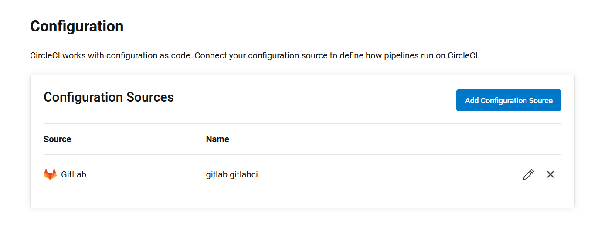
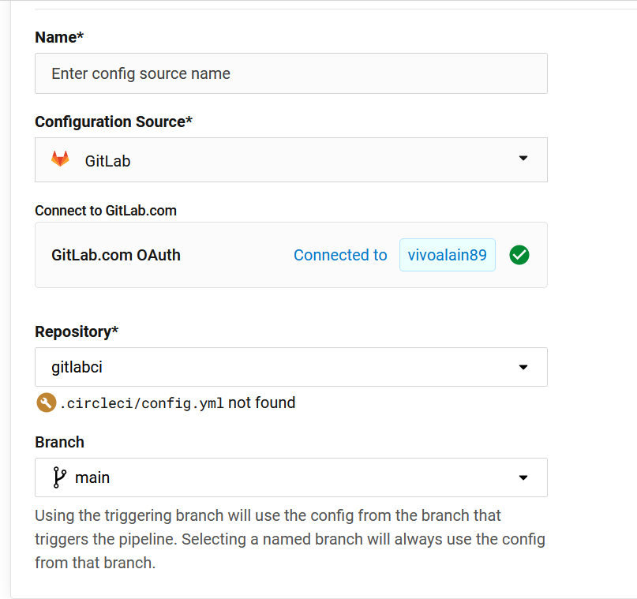

Note 2022-12-29T08.44.59
========================

Para crearnos una cuenta en CircleCI haremos uso de una cuenta en github, nos logueamos en nuestra cuenta de https://github.com/:

## Github

Confirmamos el acceso

## Gitlab

Y procedemos a crearnos nuestra cuenta en https://circleci.com/

Nos dirigimos a sign UP y llenamos nuestros datos

En este punto es importante revisar nuestro correo donde nos enviaran el linkde verificación para nuestra cuenta:

Cuenta verificacada

## Gitlab
Procedmos a conectarnos con nuestro repositorio

Autorizamos en gitlab.com:

Una vez autorizado nos redirige a la pantalla de configuración donde elegiremos el repositorio al que le haremos el despliegue:

quedando finalmente asi:

Ahora iremos a Project Settings:

Configuration:

Add configuration source:

Eligimos la rama donde lo queremos poner y salvamos:

