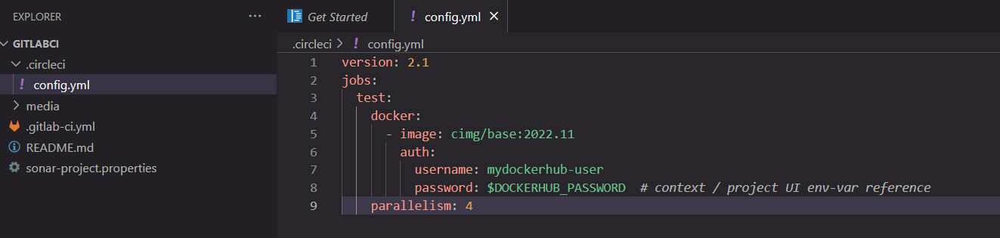

Note 2022-12-29T08.44.59
========================

Para crearnos una cuenta en CircleCI haremos uso de una cuenta en github, nos logueamos en nuestra cuenta de https://github.com/:


## Github


Confirmamos el acceso


## Gitlab


Y procedemos a crearnos nuestra cuenta en https://circleci.com/


Nos dirigimos a sign UP y llenamos nuestros datos


En este punto es importante revisar nuestro correo donde nos enviaran el linkde verificación para nuestra cuenta:


Cuenta verificacada


## Gitlab
Procedmos a conectarnos con nuestro repositorio


Autorizamos en gitlab.com:


Una vez autorizado nos redirige a la pantalla de configuración donde elegiremos el repositorio al que le haremos el despliegue:

quedando finalmente asi:


Ahora iremos a Project Settings:


Configuration:


Add configuration source:

Eligimos la rama donde lo queremos poner y salvamos:


Agregamos el siguiente archivo en el `.circleci/config.yml` en nuestra rama y ponemos una sentencia de circleci, por ejemplo:

```
version: '2.1'
jobs:
  test:
    docker:
      - image: cimg/base:2022.11
    steps:
      - run:
          name: Building artifacts
          command: |
            echo "Hello"
    parallelism: 4
workflows:
  version: 2
  build_test_deploy:
    jobs:
      - test:
          filters:
            branches:
              only: 
                - main
```




Y vemos que ya esta corriendo en circleci


Aca esta el proceso cor


