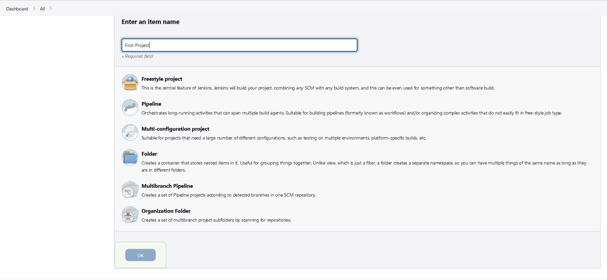
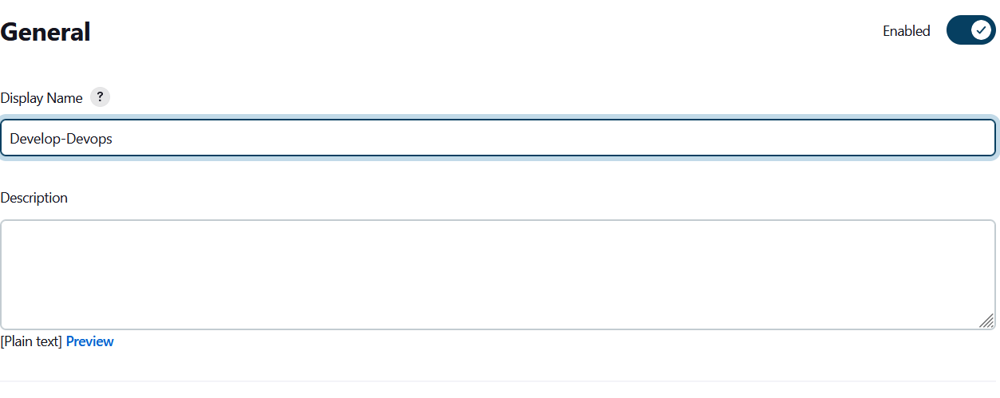
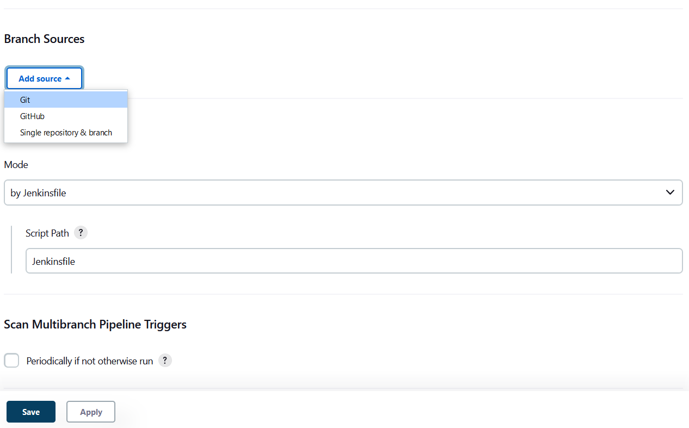
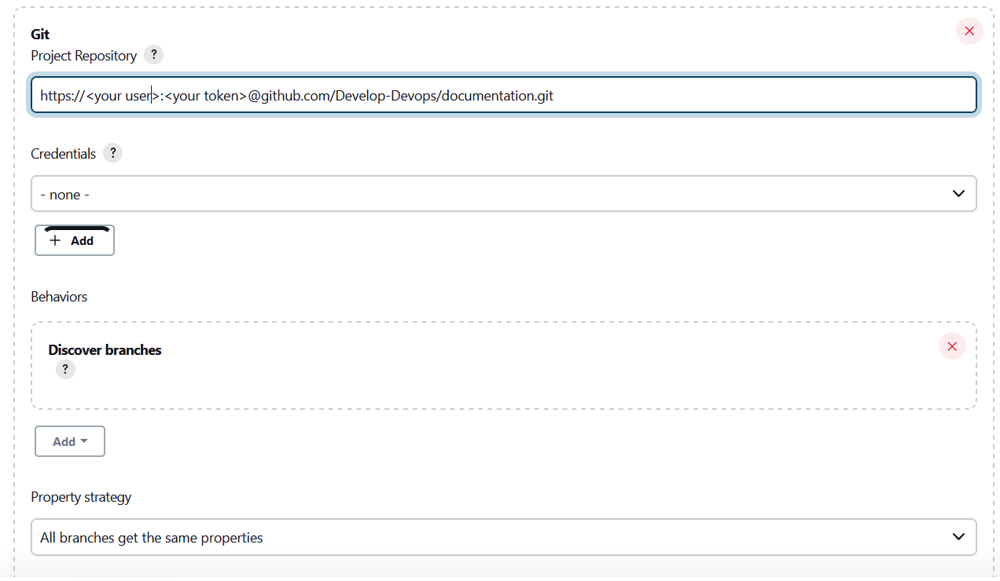
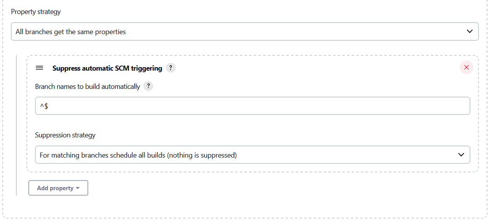
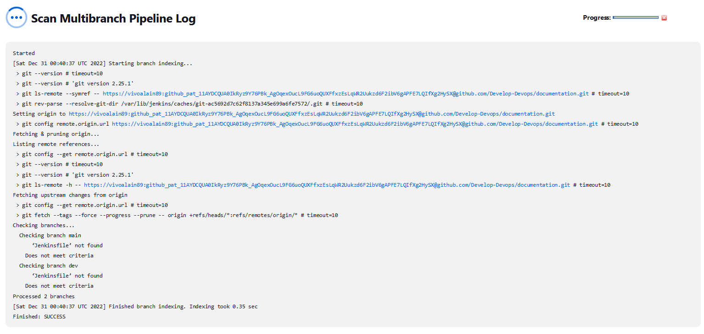
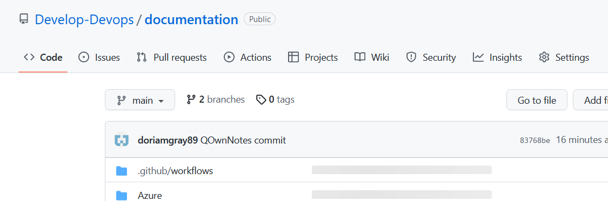

- [Install Jenkins](#install-jenkins)
  - [Cofigure virtualhost](#cofigure-virtualhost)
  - [Install suggested plugins](#install-suggested-plugins)
  - [skip and continue as admin](#skip-and-continue-as-admin)
  - [start using jenkins](#start-using-jenkins)
  - [and ready](#and-ready)
- [Configure pipeline](#configure-pipeline)
  - [new Item](#new-item)
  - [add Display Name](#add-display-name)
  - [Obtain github token](#obtain-github-token)
  - [Copy repository in Project Repository with this format](#copy-repository-in-project-repository-with-this-format)
  - [supress automatic SCM triggering](#supress-automatic-scm-triggering)
  - [Jenkinsfile](#jenkinsfile)

# Install Jenkins
```

sudo apt update && sudo apt install openjdk-11-jdk nginx -y

curl -fsSL https://pkg.jenkins.io/debian-stable/jenkins.io.key | sudo tee /usr/share/keyrings/jenkins-keyring.asc > /dev/null

echo deb [signed-by=/usr/share/keyrings/jenkins-keyring.asc] https://pkg.jenkins.io/debian-stable binary/ | sudo tee /etc/apt/sources.list.d/jenkins.list > /dev/null

sudo apt update && sudo apt install jenkins -y

snap install certbot --classic

sudo systemctl status jenkins

```


`sudo systemctl enable --now jenkins`


## Cofigure virtualhost
```
host_name='your hostname'

cat << EOF > /etc/nginx/sites-available/jenkins

server {

        server_name $host_name;
        location /health/ {
                return 200 "ok";
                add_header Content-Type text/plain;

        }
        location / {

                proxy_set_header X-Real-IP  \$remote_addr;
                proxy_set_header X-Forwarded-For \$remote_addr;
                proxy_set_header Host \$host;
                proxy_set_header X-Forwarded-Proto \$scheme;
                proxy_pass          http://localhost:8080;

        }

    listen [::]:80;
    listen 80;

}

EOF
```

```
ln -s /etc/nginx/sites-available/jenkins /etc/nginx/sites-enabled/
nginx -t

systemctl start nginx
systemctl enable nginx
systemctl status nginx

certbot --nginx
```

Open https://<your hostname> in your browser


Copy password in /var/lib/jenkins/secrets/initialAdminPassword


## Install suggested plugins


## skip and continue as admin


## start using jenkins


## and ready


# Configure pipeline

## new Item


Enter name and select Multibranch Pipeline



## add Display Name



In branch Source select git




## Obtain github token

[github-token](github-token.md)

## Copy repository in Project Repository with this format

https://<user>:<token>@repository/url.git



## supress automatic SCM triggering



and save



Now you need to add Jenkinsfile in your branch

## Jenkinsfile

```
pipeline {
    agent {label 'master'}
	stages {
       stage('Deploy Prod') {
           when {expression { env.BRANCH_NAME == 'main' }}
           agent { node {label 'master' }}
           steps {
                sh '''
                echo Deploying ....
                '''
           }
       }
    }
	post
	    {
            success {
                sh '''
                    curl -i -X GET "https://api.telegram.org/bot${TELEGRAM_TOKEN}/sendMessage?chat_id=${TELEGRAM_GROUP}&text=✅✅✅The '"$JOB_NAME"' job execution was successful, for details go to: '"$RUN_DISPLAY_URL"' "
                '''
                }
            failure {
                sh '''
                    curl -i -X GET "https://api.telegram.org/bot${TELEGRAM_TOKEN}/sendMessage?chat_id=${TELEGRAM_GROUP}&text=🚨🚨🚨The '"$JOB_NAME"' job execution has failed, for details go to: '"$RUN_DISPLAY_URL"' "
                '''
                }
            aborted{
                sh '''
                    curl -i -X GET "https://api.telegram.org/bot${TELEGRAM_TOKEN}/sendMessage?chat_id=${TELEGRAM_GROUP}&text=The '"$JOB_NAME"' job execution was aborted, for details go to: '"$RUN_DISPLAY_URL"' "
                '''
                }
        }

}
```
## Configure node label

[add-jenkins-label](add-jenkins-label.md)

## add jenkins-token
[add-jenkins-token](add-jenkins-token.md)

## Configure webhook in github

https://\<user\>:\<password\>@<server>/job/<proyect>/job/<branch>/build

Go to settings in your proyect




