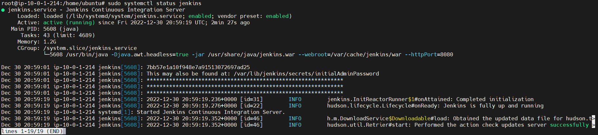
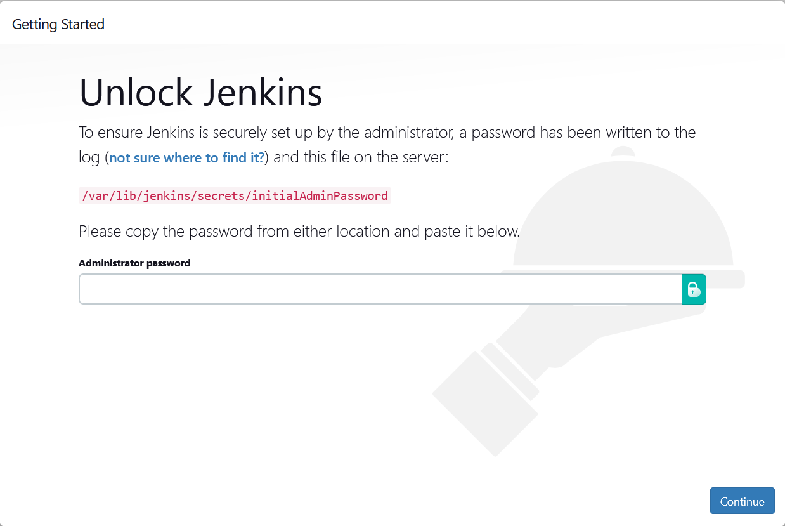
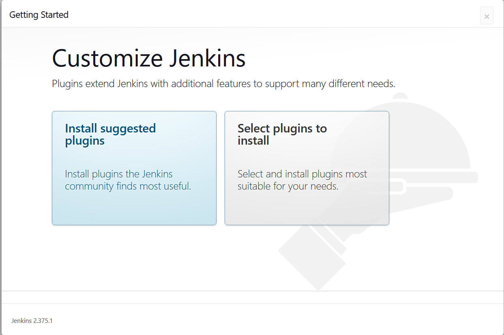
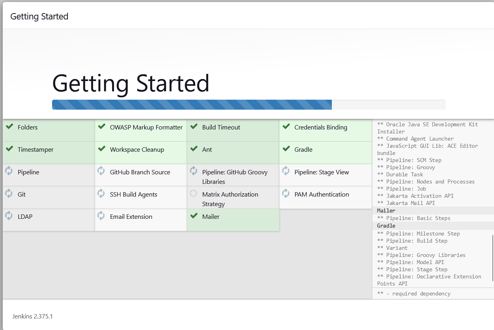
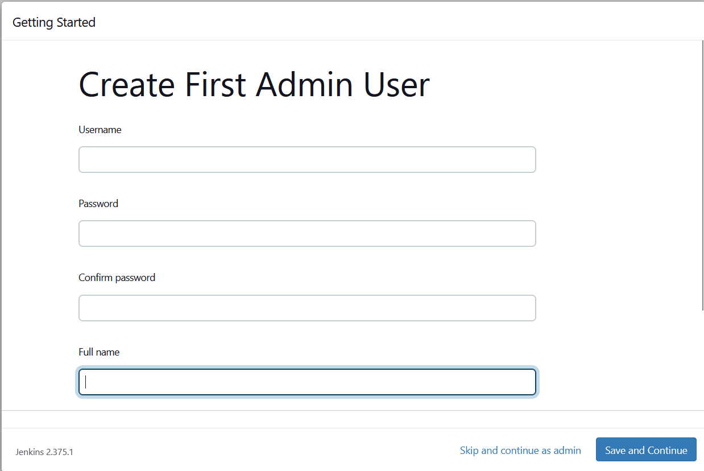
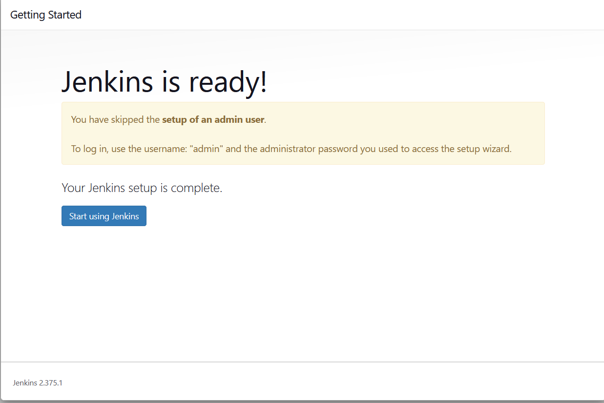
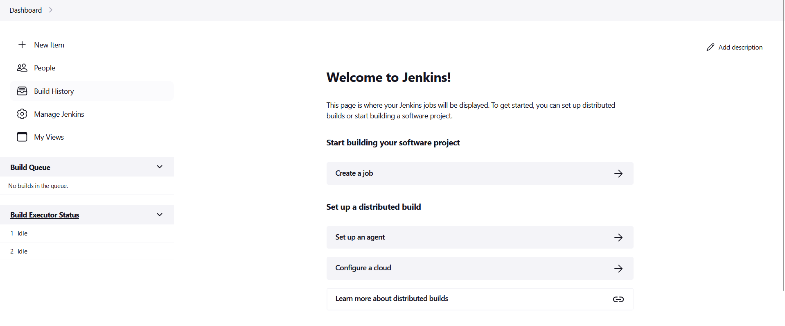
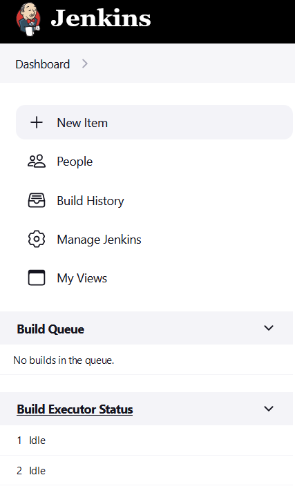

# Install Jenkins
```

sudo apt update && sudo apt install openjdk-11-jdk nginx -y

curl -fsSL https://pkg.jenkins.io/debian-stable/jenkins.io.key | sudo tee /usr/share/keyrings/jenkins-keyring.asc > /dev/null

echo deb [signed-by=/usr/share/keyrings/jenkins-keyring.asc] https://pkg.jenkins.io/debian-stable binary/ | sudo tee /etc/apt/sources.list.d/jenkins.list > /dev/null

sudo apt update && sudo apt install jenkins -y

snap install certbot --classic

sudo systemctl status jenkins

```


`sudo systemctl enable --now jenkins`


## Cofigure virtualhost
```
host_name='your hostname'

cat << EOF > /etc/nginx/sites-available/jenkins

server {

        server_name $host_name;
        location /health/ {
                return 200 "ok";
                add_header Content-Type text/plain;

        }
        location / {

                proxy_set_header X-Real-IP  \$remote_addr;
                proxy_set_header X-Forwarded-For \$remote_addr;
                proxy_set_header Host \$host;
                proxy_set_header X-Forwarded-Proto \$scheme;
                proxy_pass          http://localhost:8080;

        }

    listen [::]:80;
    listen 80;

}

EOF
```

```
ln -s /etc/nginx/sites-available/jenkins /etc/nginx/sites-enabled/
nginx -t

systemctl start nginx
systemctl enable nginx
systemctl status nginx

certbot --nginx
```

Open https://<your hostname> in your browser



Copy password in /var/lib/jenkins/secrets/initialAdminPassword



## Install suggested plugins


## skip and continue as admin



## start using jenkins



## and ready




# Configure pipeline

## new Item




