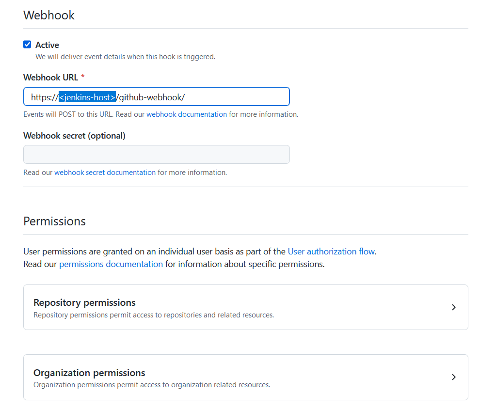

## github apps

### developers settings

### new github App

### Copy your data

### Generate private key

### Converting the private key for Jenkins

After you have generated the private key authenticating to the GitHub App, you need to convert the key into a different format that Jenkins can use with the following command:

openssl pkcs8 -topk8 -inform PEM -outform PEM -in key-in-your-downloads-folder.pem -out converted-github-app.pem -nocrypt

https://docs.cloudbees.com/docs/cloudbees-ci/latest/cloud-admin-guide/github-app-auth

