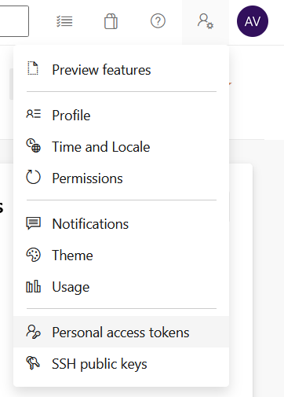

Loguearse con un usuario distinto a root en mi caso utilizaré ubuntu

```
mkdir myagent && cd myagent
wget https://vstsagentpackage.azureedge.net/agent/2.213.2/vsts-agent-linux-x64-2.213.2.tar.gz
tar zxvf vsts-agent-linux-x64-2.213.2.tar.gz
./config.sh
```

# Server URL
https://dev.azure.com/{your-organization}

# Personal token



# Pool
Eliges el pool al que quieras agregarlo
