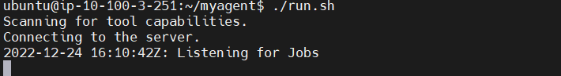
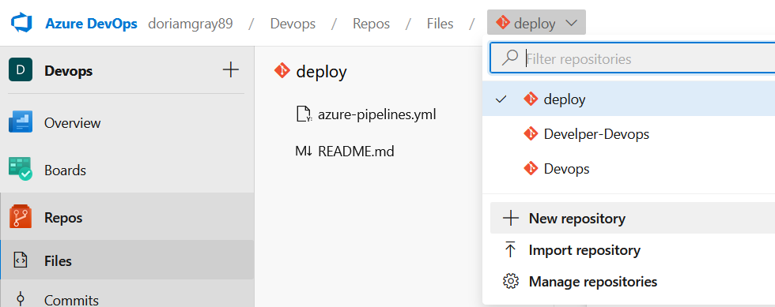
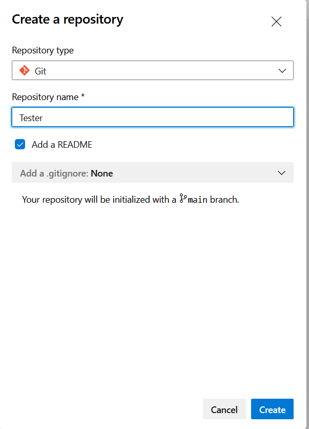
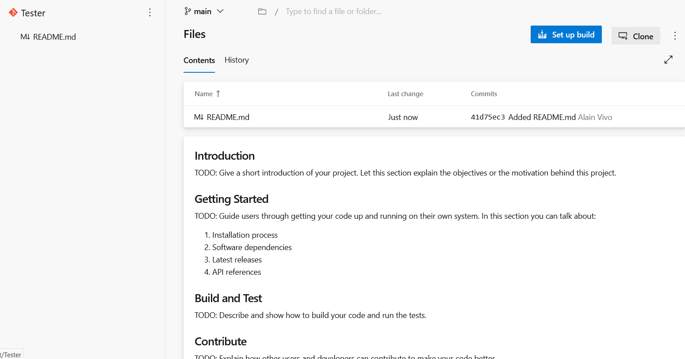
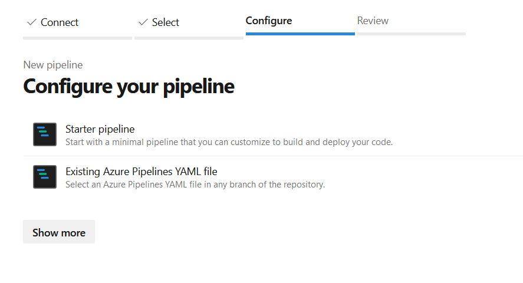
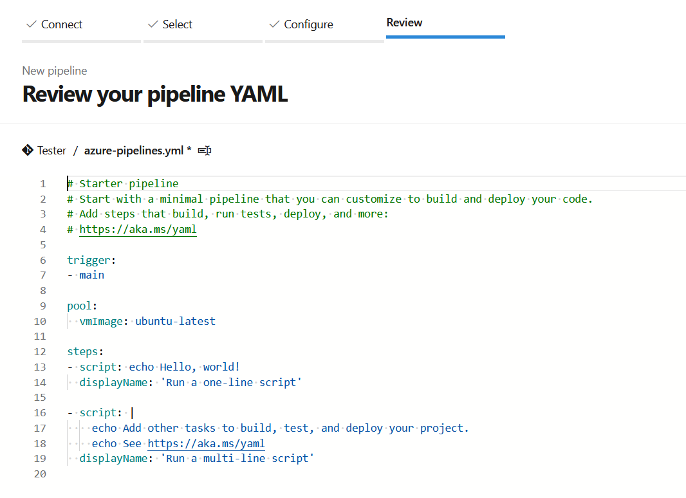
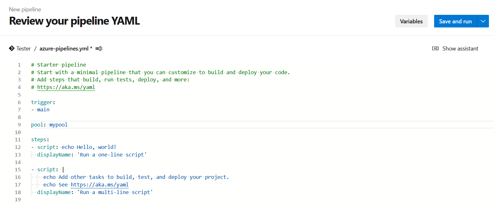

Loguearse con un usuario distinto a root en mi caso utilizaré ubuntu

```
mkdir myagent && cd myagent
wget https://vstsagentpackage.azureedge.net/agent/2.213.2/vsts-agent-linux-x64-2.213.2.tar.gz
tar zxvf vsts-agent-linux-x64-2.213.2.tar.gz
./config.sh
```

# Server URL
https://dev.azure.com/{your-organization}

# Personal token


# Pool
Eliges el pool al que quieras agregarlo, en mi caso agregue uno llamado mypool

Una vez configurado correr ./run.sh y comenzamos a ver al servicio escuchando por nuevos jobs:



# Pipeline

Una vez configurado el agente procedemos a crear un pipeline:

## Crear repositorio

Nos dirigimos a nuestra organización -> Repos -> New Repository



Crearemos uno llamado tester




## Build

Para facilitarnos el trabajo podemos ir al botón Set up Build que aparece en el propio repositorio:



y nos lleva a una pantalla como esta:



Damos starter pipeline dado de que hasta el momento no disponemos de uno:


y rapidamente nos genera un pipeline de ejemplo

En nuestro caso cambiaremos el pool por el creado por nosotros

cambiamos:
```
pool:
  vmImage: ubuntu-latest
```

por

`pool: mypool`

agremosle una pequeña dificultad y de paso una herramienta q nos será util (variables). Si notan en el panel hay un apartado variable



Agregamos una nueva


