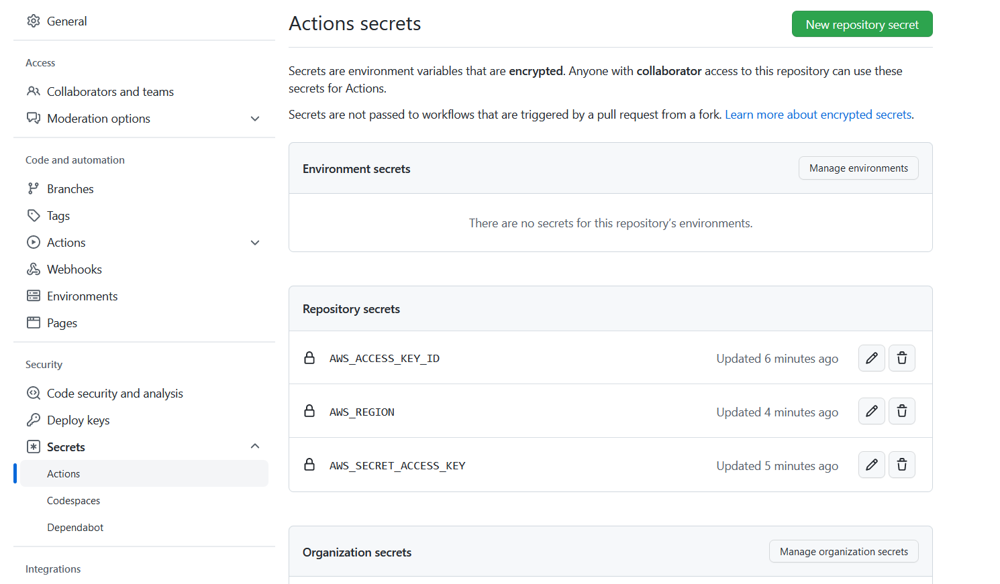

Crear directorio .github/workflows/ y dentro escribir un .yml por ejemplo

`.github/workflows/deploy.yml`

```
name: Deploy to ECR

on:
 push:
    branches:
     - dev
     - 'feature/**'
     - 'bugfix/**'
     - 'hotfix/**'
jobs:
  build:    
    name: Build Image
    runs-on: ubuntu-latest

    steps:
      - name: Check out code
        uses: actions/checkout@v2

      - name: Configure AWS credentials
        uses: aws-actions/configure-aws-credentials@v1
        with:
          aws-access-key-id: ${{ secrets.AWS_ACCESS_KEY_ID }}
          aws-secret-access-key: ${{ secrets.AWS_SECRET_ACCESS_KEY }}
          aws-region: ${{ secrets.AWS_REGION }}

      - name: Login to Amazon ECR
        id: login-ecr
        uses: aws-actions/amazon-ecr-login@v1

      - name: Build, tag, and push image to Amazon ECR
        env:
          ECR_REGISTRY: ${{ steps.login-ecr.outputs.registry }}
          ECR_REPOSITORY: nginx
          IMAGE_TAG: dev
        run: |
          docker build -t $ECR_REGISTRY/$ECR_REPOSITORY:$IMAGE_TAG -f docker/nginx-fpm/Dockerfile.nginx .
          docker push $ECR_REGISTRY/$ECR_REPOSITORY:$IMAGE_TAG
```

## Explicación del deploy

### Nombre del deploy

```
name: Deploy to ECR

on:
 push:
    branches:
     - dev
     - 'feature/**'
     - 'bugfix/**'
     - 'hotfix/**'
```

Aca tenemos el nombre del deploy `Deploy to ECR` y las ramas que se dispararan cuando se haga un cambio en este caso:
```
     - dev
     - 'feature/**'
     - 'bugfix/**'
     - 'hotfix/**'
```

### jobs
```
jobs:
  build:
    name: Build Image
    runs-on: ubuntu-latest
```
en este apartado se agregan los jobs y los pasos necesario para hacer el despliegue, en este caso estamos corriendo el job `Build Image` corre en un runner de github llamado `ubuntu-latest` aca podemos agregar otras opciones que tiene github o un runner propio agregado por nosotros

#### steps


En `settings -> Secrets -> Actions` agregaremos las variables de entorno que necesitaremos para el despliegue en aws, estas serán usadas en el despliegue con la ventaja que no serán publicas en el momento del despliegue lo cual le agrega seguridad a nuestro despliegue:




