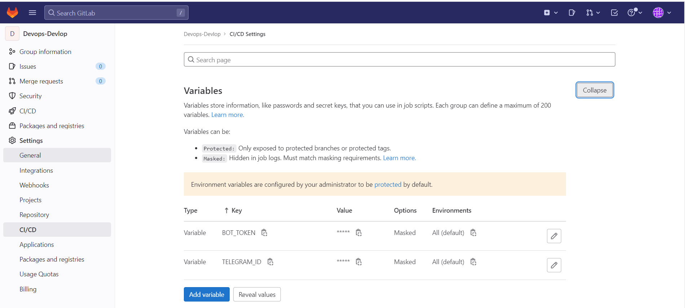
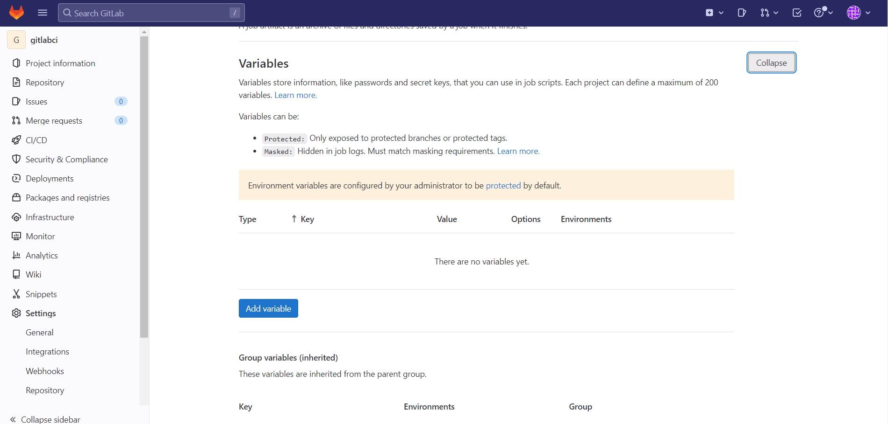
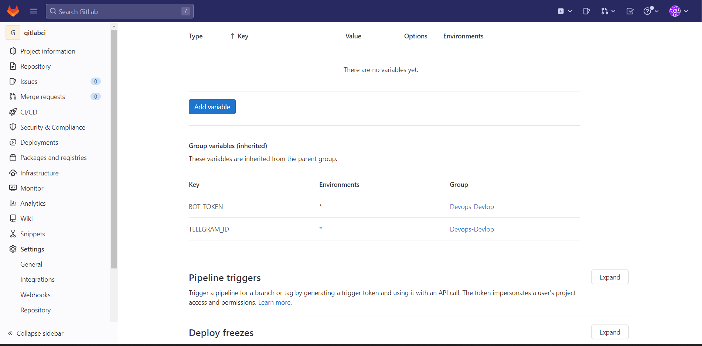

- [Despligue](#despligue)
- [Variables de gitlabci](#variables-de-gitlabci)
- [Variables personalizadas](#variables-personalizadas)
  - [Variables del grupo](#variables-del-grupo)
  - [Variables del repositorio](#variables-del-repositorio)
    - [variables heredadas del grupo](#variables-heredadas-del-grupo)

# Despligue


```
cd existing_repo
git remote add origin https://gitlab.com/devops-develop/gitlabci.git
git branch -M main
git push -uf origin main
```

# Variables de gitlabci

```
CI_PROJECT_URL: URL del proyecto que esta corriendo en el gitlabci
CI_COMMIT_BRANCH: Rama que esta corriendo
```

# Variables personalizadas

## Variables del grupo


## Variables del repositorio


### variables heredadas del grupo



