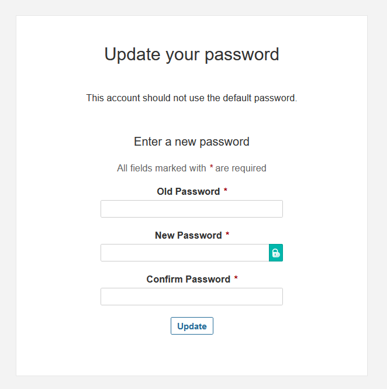
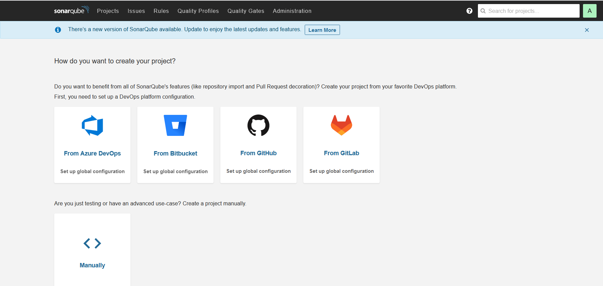

# Install jdk
```
apt-get install openjdk-11-jdk -y
sudo sh -c 'echo "deb http://apt.postgresql.org/pub/repos/apt/ `lsb_release -cs`-pgdg main" >> /etc/apt/sources.list.d/pgdg.list'
wget -q https://www.postgresql.org/media/keys/ACCC4CF8.asc -O - | sudo apt-key add -

sudo apt install postgresql postgresql-contrib -y
sudo systemctl enable postgresql
sudo systemctl start postgresql
```

```
passwd postgres

su - postgres

createuser sonar
psql

ALTER USER sonar WITH ENCRYPTED password '<your password>';

CREATE DATABASE sonarqube OWNER sonar;
GRANT ALL PRIVILEGES ON DATABASE sonarqube to sonar;

\q

exit
```

# download sonarqube
```
sudo apt-get install zip -y

cd /tmp

wget https://binaries.sonarsource.com/Distribution/sonarqube/sonarqube-9.5.0.56709.zip

unzip sonarqube-9.5.0.56709.zip

mv sonarqube-9.5.0.56709 /opt/sonarqube
```

## Create a sonar group.

```
sudo groupadd sonar
```

## Create a sonar user and set /opt/sonarqube as the home directory.

```
sudo useradd -d /opt/sonarqube -g sonar sonar
```

## Grant the sonar user access to the /opt/sonarqube directory.

```
sudo chown sonar:sonar /opt/sonarqube -R
```

vi /opt/sonarqube/conf/sonar.properties

Find the following lines:

```
#sonar.jdbc.username=
#sonar.jdbc.password=
```

Uncomment the lines, and add the database user and password you created in Step 2.

```
sonar.jdbc.username=sonar
sonar.jdbc.password=my_strong_password
```

Below those two lines, add the sonar.jdbc.url.

```
sonar.jdbc.url=jdbc:postgresql://localhost:5432/sonarqube
```

# Create service
```
cat << EOF > /etc/systemd/system/sonar.service

[Unit]
Description=SonarQube service
After=syslog.target network.target

[Service]
Type=forking

ExecStart=/opt/sonarqube/bin/linux-x86-64/sonar.sh start
ExecStop=/opt/sonarqube/bin/linux-x86-64/sonar.sh stop

User=sonar
Group=sonar
Restart=always

LimitNOFILE=65536
LimitNPROC=4096

[Install]
WantedBy=multi-user.target

EOF
```

```
sudo systemctl enable sonar
sudo systemctl start sonar
sudo systemctl status sonar
```
# Install nginx 
```
apt install nginx -y
```
## virtual host

```
cat << EOF > /etc/nginx/sites-enabled/sonarqube

server{
    server_name sonarqube.<your domain>;

    access_log  /var/log/nginx/sonar.access.log;
    error_log   /var/log/nginx/sonar.error.log;

    proxy_buffers 16 64k;
    proxy_buffer_size 128k;

    location / {
        proxy_pass  http://127.0.0.1:9000;
        proxy_next_upstream error timeout invalid_header http_500 http_502 http_503 http_504;
        proxy_redirect off;

        proxy_set_header    Host            \$host;
        proxy_set_header    X-Real-IP       \$remote_addr;
        proxy_set_header    X-Forwarded-For \$proxy_add_x_forwarded_for;
        proxy_set_header    X-Forwarded-Proto http;
    }


    listen      80;
    server_name sonarqube.<your domain>;

}


EOF
```
# install certbot

```
snap install certbot --classic
```
## create certificate

```
certbot --nginx
```

# Modify Kernel System Limits

 vi /etc/sysctl.conf

```
vm.max_map_count=262144
fs.file-max=65536
```

# add ulimit
```
ulimit -n 65536
ulimit -u 4096
```
```
sysctl -p
```

# Initial creedentials

```
admin:admin
```


change password and voila


